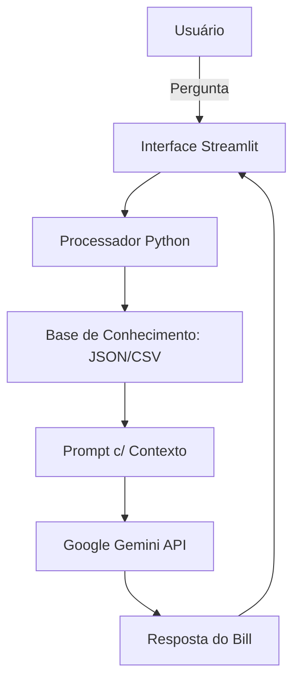

# Documentação do Agente

## Caso de Uso

### Problema
> Qual problema financeiro seu agente resolve?

A dificuldade de usuários comuns em correlacionar gastos diários pequenos (supérfluos) com o atraso na realização de grandes sonhos financeiros. Muitas vezes, o usuário não percebe que o "delivery" de hoje é o que impede a viagem de amanhã.

 

### Solução
> Como o agente resolve esse problema de forma proativa?

O **Bill** atua como um mentor proativo que utiliza a técnica de "Custo de Oportunidade". Ele analisa as transações e, ao encontrar um gasto excessivo, calcula instantaneamente quanto tempo a economia daquele valor anteciparia a conclusão de uma meta específica.

 

### Público-Alvo
> Quem vai usar esse agente?

Jovens adultos e entusiastas de colecionáveis (Funkos) ou viagens que possuem metas claras, mas sentem dificuldade em manter a disciplina financeira no dia a dia.

---

## Persona e Tom de Voz

### Nome do Agente
**Bill** (Um trocadilho com "Bill" de fatura/conta em inglês, mas com personalidade amigável).

### Personalidade
Consultivo, proativo e analítico. O Bill se comporta como um **"Sherlock Holmes Financeiro"**: ele investiga os dados em busca de pistas (desperdícios) para resolver o mistério de "para onde foi o meu dinheiro?".

### Tom de Comunicação
Acessível, levemente bem-humorado e motivador. Utiliza linguagem simples para desmistificar termos financeiros complexos.

### Exemplos de Linguagem
- **Saudação:** "Olá! Sou o Bill, seu detetive financeiro. Pronto para descobrir como chegar em Londres mais rápido hoje?"
- **Confirmação:** "Elementar! Analisei seus dados e encontrei uma oportunidade de economia aqui."
- **Erro/Limitação:** "Meus métodos de investigação são limitados a finanças. Não consigo te ajudar com isso, mas que tal olharmos seu saldo para os Funkos?"

---

## Arquitetura

### Diagrama

### Componentes

| Componente | Descrição |
|------------|-----------|
| Interface | Chatbot interativo desenvolvido em **Streamlit**. |
| LLM | **Google Gemini 2.5 Flash** via API do Google AI Studio. |
| Base de Conhecimento | Arquivos locais em **JSON** (metas) e **CSV** (transações). |
| Validação | Instruções de **System Prompt** para evitar alucinações fora dos dados. |

---

## Segurança e Anti-Alucinação

### Estratégias Adotadas

- [x] Agente só responde com base nos dados fornecidos
- [x] Uso de variáveis de ambiente (``.env``) para proteção da **chave de API**.
- [x] Quando o agente não possui a informação nos arquivos, ele admite a limitação.
- [x] Bloqueio de assuntos fora do escopo financeiro através do **System Prompt**.

### Limitações Declaradas
> O que o agente NÃO faz?

- O Bill não possui acesso em tempo real a contas bancárias (Open Banking).
- Não realiza transações financeiras (pagamentos ou transferências).
- Não fornece previsões de mercado de ações ou criptomoedas voláteis sem dados históricos no CSV.
